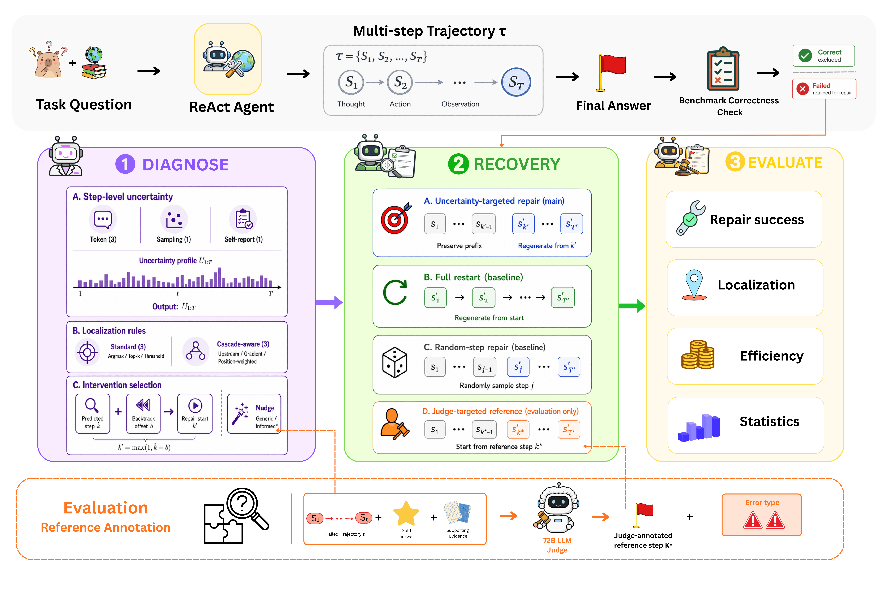

# Uncertainty-Guided Repair of Multi-Step Language-Model Agents

When a multi-step agent fails, should it preserve the useful prefix and
regenerate only a selected suffix, or discard the failed trajectory and
restart from the original task?

This repository provides a controlled experimental framework for studying
**where recovery should begin**, **whether uncertainty can identify useful
intervention points**, and **when targeted repair is preferable to full
restart** in ReAct-style language-model agents.


<p align="center">
  <a href="assets/arch.png">
    
  </a>
</p>

<p align="center">
  <em>
    Failed ReAct trajectories are scored using step-level uncertainty,
    localized using standard and cascade-aware rules, repaired through
    targeted regeneration or full restart, and evaluated under matched
    regeneration-token budgets. Orange dashed components are used only for
    reference annotation and evaluation.
  </em>
</p>

---

## Overview

The framework follows the pipeline:

```text
Task + offline evidence
        ↓
ReAct agent and tools
        ↓
Multi-step trajectory τ with stored token log-probabilities
        ↓
Benchmark correctness check
        ↓
Failed trajectory
        ↓
Uncertainty scoring and intervention localization
        ↓
Targeted repair / Full restart / Random repair / Judge-targeted reference
        ↓
Repair-success, localization, cost, and statistical evaluation
```

A trajectory is represented as:

```text
τ = (s₁, s₂, …, sₜ)
```

where each step contains a reasoning trace, tool action, action input, and
tool observation.

The main comparison is between:

- **Uncertainty-targeted repair:** preserve the prefix before a selected
  repair origin and regenerate the remaining suffix.
- **Full restart:** discard the failed trajectory and regenerate from the
  original task.

Random-step and judge-targeted repairs are included as comparison strategies.

---

## Research Questions

### RQ1 — Is targeted repair worth pursuing?

How does repair from a judge-annotated reference step compare with full
restart under a matched regeneration-token budget?

### RQ2 — What is the cost of imperfect localization?

How closely can uncertainty-guided repair approach judge-targeted reference
repair when the intervention point must be estimated from the failed
trajectory?

### RQ3 — Is uncertainty better than chance?

Does uncertainty-guided intervention outperform repair from a randomly
sampled step?

Additional analyses study:

- whether useful repair origins occur upstream of uncertainty peaks;
- the effect of backtracking before regeneration;
- generic versus error-type-informed nudges;
- repair-success versus token-cost trade-offs;
- differences across task types and trajectory lengths.

---

## Experimental Scope

The repository is configured to support the following experiment matrix.

| Axis | Configured coverage |
|---|---|
| **Agent models** | 8 open-weight language models across 7B–72B |
| **Datasets** | HotpotQA, FEVER, 2WikiMultiHopQA, MuSiQue |
| **Base strategies** | 33: 3 comparisons + 5 uncertainty families × 6 localization rules |
| **Seeds** | 3 |
| **Inference** | vLLM with AWQ 4-bit quantization |
| **Reference annotator** | Qwen2.5-72B-Instruct-AWQ |

The repository may support a larger matrix than the subset reported in a
specific paper draft. Any released result should state the exact evaluated
models, datasets, configurations, and code commit.

### Agent Models

| Tier | Models |
|---|---|
| **Small, 7–9B** | Qwen2.5-7B, Llama-3.1-8B, Gemma-2-9B |
| **Medium, 12–27B** | Mistral-Nemo-12B, Qwen2.5-14B, Gemma-2-27B |
| **Large, 70–72B** | Llama-3.3-70B, Qwen2.5-72B |
| **Reference judge** | Qwen2.5-72B-Instruct-AWQ |

### Supported Datasets

| Dataset | Development size | Task type | Sampling strata |
|---|---:|---|---|
| HotpotQA | 7,405 | Multi-hop question answering | Level and question type |
| FEVER | 19,998 | Fact verification | Answer label |
| 2WikiMultiHopQA | 12,576 | Multi-hop question answering | Question type |
| MuSiQue | 2,417 | Compositional multi-hop QA | Hop count |

Retrieval operates over question-specific offline document collections.
This avoids live-web variation and supports reproducible agent trajectories.

---

## Method

### 1. Failure-Set Construction

For each task instance:

1. The ReAct agent interacts with the task-specific tools and offline
   document environment.
2. The complete trajectory and per-token log-probabilities are stored.
3. The final answer is evaluated against the benchmark reference.
4. Correct trajectories are excluded.
5. Failed trajectories are retained for diagnosis and repair.

This is an **offline benchmark gate**, not a deployable failure detector.

### 2. Step-Level Uncertainty

The framework supports five uncertainty families or metric groups:

| Family | Signal |
|---|---|
| Token entropy | Renormalized top-\(K\) token entropy |
| Sampled-token probability | \(1-p_{\text{sampled}}\) |
| Perplexity | Step-level exponentiated mean surprisal |
| Self-consistency | Disagreement across sampled actions |
| Verbalized confidence | Model-reported confidence converted to uncertainty |

These signals produce a step-level profile:

```text
U(τ) = (U₁, U₂, …, Uₜ)
```

### 3. Localization Rules

Each uncertainty profile is converted into a predicted intervention point
using one of six rules.

| Standard rules | Cascade-aware rules |
|---|---|
| Argmax uncertainty | Upstream lookback |
| Earliest among top-\(k\) | Largest uncertainty increase |
| Earliest above percentile threshold | Position-weighted uncertainty |

The cascade-aware rules test whether a useful repair origin may occur before
the visible uncertainty peak.

### 4. Intervention Configuration

For a predicted step \(\hat{k}\), targeted repair may apply a backtracking
offset \(b\):

```text
k′ = max(1, k̂ − b)
```

The repair preserves:

```text
s₁, …, sₖ′₋₁
```

and regenerates:

```text
s′ₖ′, …, s′ₜ′
```

Before regeneration, the framework can inject:

- **Generic nudge:** asks the model to reconsider the previous attempt.
- **Informed nudge:** supplies an error-class-specific hint derived from the
  evaluation-only reference annotation.

### 5. Repair Strategies

The 33 base strategies consist of three comparisons and 30
uncertainty-guided combinations.

#### Comparison Strategies

- **Full restart:** regenerate the complete trajectory.
- **Random-step repair:** regenerate from a randomly sampled intervention
  point.
- **Judge-targeted reference repair:** regenerate from the reference step
  annotated by the 72B judge.

#### Uncertainty-Guided Strategies

```text
5 uncertainty families × 6 localization rules = 30 strategies
```

| Uncertainty family | Argmax | Top-\(k\) earliest | Percentile | Upstream | Gradient | Weighted |
|---|:---:|:---:|:---:|:---:|:---:|:---:|
| Token entropy | ✓ | ✓ | ✓ | ✓ | ✓ | ✓ |
| Perplexity | ✓ | ✓ | ✓ | ✓ | ✓ | ✓ |
| Sampled-token probability complement | ✓ | ✓ | ✓ | ✓ | ✓ | ✓ |
| Self-consistency | ✓ | ✓ | ✓ | ✓ | ✓ | ✓ |
| Verbalized confidence | ✓ | ✓ | ✓ | ✓ | ✓ | ✓ |

### 6. Matched Recovery Budget

Repair strategies are compared under the same regeneration-token budget:

```text
B = m × C(τ)
```

where \(C(\tau)\) is the original trajectory-generation cost and \(m\) is the
configured budget multiplier.

Wall-clock time and tool calls may be reported as observed costs, but they
are not assumed to be matched unless a particular experiment explicitly
controls them.

### 7. Deduplication

Different strategy definitions can produce the same effective repair
configuration. Identical configurations are executed once and their
outcomes are reused.

The exact deduplication key should include every factor that changes the
repair prompt or rollout, such as the intervention point, seed, nudge,
budget, and relevant repair settings.

---

## Evaluation-Only Reference Annotation

Reference annotation is separated from the uncertainty-guided repair path.

It combines:

1. a programmatic retrieval-gap cue; and
2. a Qwen2.5-72B judge examining the failed trajectory, gold answer, and
   supporting evidence.

The annotation produces:

- a **judge-annotated reference step** \(k^*\);
- a **judge-annotated error class** \(e^*\).

The five compact error classes are:

```text
Search | Extraction | Reasoning | Answer | Tool/Format
```

These correspond to wrong search queries, incorrect fact extraction, faulty
reasoning, premature or wrong answers, and tool-formatting errors.

The reference annotation is used for:

- judge-targeted reference repair;
- localization evaluation;
- informed-nudge experiments;
- error-type and failure-mode analysis.

It is not available to the ordinary uncertainty-only repair path.

---

## Evaluation Metrics

### Repair Success

A failed trajectory is counted as repaired when the regenerated answer
satisfies the benchmark correctness criterion:

```text
EM = 1 or F1 ≥ 0.5
```

The primary summary is the **fix rate** over originally failed trajectories.

### Localization

- Exact step agreement
- Within-1 agreement
- Mean reciprocal rank

### Efficiency

- Additional generated tokens
- Total repair tokens
- Optional observed runtime or tool-use statistics

### Statistical Analysis

- Bootstrap 95% confidence intervals
- Paired McNemar tests
- Holm correction for multiple comparisons

Resampling and paired comparisons should preserve question-level dependence
when multiple seeds or repair variants are associated with the same task
instance.

---

## Quick Start

### Local or H100 Execution

See:

```text
RUN_LOCAL.md
```

### Google Colab

[](
https://colab.research.google.com/github/kishormorol/agent-repair/blob/main/run_colab.ipynb
)

### Full Experiment Matrix

```bash
python scripts/run_experiment.py \
  --config config/config_experiment.yaml
```

---

## Dataset-Specific Colab Notebooks

| Dataset | Notebook |
|---|---|
| **HotpotQA** | [Open in Colab](https://colab.research.google.com/github/kishormorol/agent-repair/blob/main/run_colab_hotpotqa.ipynb) |
| **FEVER** | [Open in Colab](https://colab.research.google.com/github/kishormorol/agent-repair/blob/main/run_colab_fever.ipynb) |
| **2WikiMultiHopQA** | [Open in Colab](https://colab.research.google.com/github/kishormorol/agent-repair/blob/main/run_colab_2wikimultihopqa.ipynb) |
| **MuSiQue** | [Open in Colab](https://colab.research.google.com/github/kishormorol/agent-repair/blob/main/run_colab_musique.ipynb) |

The notebooks can be run independently when separate compute instances are
available.

---

## Pipeline Stages

| Stage | Script | Function | Approximate runtime* |
|---:|---|---|---|
| 0 | `run_setup.py` | Download data and initialize output directories | Minutes |
| 1 | `run_generate.py` | Generate ReAct trajectories and retain failures | Hours |
| 2 | `run_uncertainty.py` | Compute step-level uncertainty signals | Hours |
| 3 | `run_annotate.py` | Produce reference annotations and optional human-validation inputs | Hours |
| 4 | `run_localize.py` | Apply metric–rule localization combinations | Minutes |
| 5 | `run_repair.py` | Execute batched, resumable, deduplicated repair configurations | Hours |
| 6 | `run_eval.py` | Produce metrics, statistical tests, analyses, and figures | Minutes |

\* Runtime depends on model size, number of questions, batch configuration,
hardware, quantization, repair budget, and uncertainty method.

Every stage is designed to be resumable. Re-running the same command should
continue from existing outputs rather than recomputing completed work.

---

## Reproducibility Controls

- Offline question-specific evidence collections
- Stored model and tokenizer identifiers
- Stored token log-probabilities
- Fixed dataset samples and stratification metadata
- Matched regeneration-token budgets
- Multiple random seeds
- Paired comparisons over the same task instances
- Resumable checkpoints
- Deduplication of identical repair configurations
- Config-driven model and dataset selection

For a publishable result release, also store:

- exact Git commit;
- complete resolved configuration;
- package lock file or environment export;
- CUDA, driver, and vLLM versions;
- model revision and quantization metadata;
- task IDs included in each split;
- generated trajectories and repair outputs;
- statistical-analysis artifacts.


## Reading the Outputs

| Path | Content |
|---|---|
| `outputs/tables/summary.txt` | Plain-language summary of the research questions |
| `outputs/tables/main_results_readable.csv` | Percentage-formatted strategy results |
| `outputs/tables/main_results.csv` | Raw metric values |
| `outputs/tables/rq_tests.json` | Paired statistical comparisons |
| `outputs/tables/failure_modes.json` | Localization and repair failure-mode analysis |
| `outputs/figures/` | Main result plots, heatmaps, cost–success analyses, and failure-mode figures |


---

## Interpreting Results Carefully

Several quantities in this repository are research constructs rather than
direct ground truth:

- \(k^*\) is a judge-annotated reference step, not necessarily the uniquely
  causal or optimal intervention point.
- An oracle-union result that counts success when any strategy succeeds is an
  upper bound unless a deployable selector chooses among candidates without
  gold labels.
- Full restart outperforming targeted repair is consistent with harmful
  retained context, but does not alone establish context contamination as
  the causal mechanism.
- Backtracking improvements are consistent with upstream error propagation,
  but can also reflect annotation noise or mismatch between the earliest
  visible error and the best intervention point.
- The best uncertainty strategy should be selected on validation data rather
  than chosen post hoc on the final test set.

---

## Citation

A formal citation will be added when the paper is publicly released.

```bibtex
@misc{agentrepair2027,
  title  = {Uncertainty-Guided Error Repair in Multi-Step Language Model
            Agents: When to Target, When to Restart},
  author = {Anonymous},
  year   = {2027},
  note   = {Manuscript under review}
}
```
## License
Apache License 2.0
